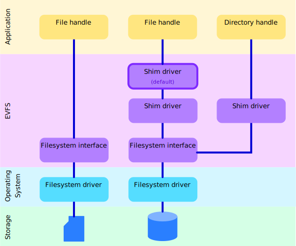

.. image:: doc/images/evfs.png

====
EVFS
====

*Embedded Virtual Filesystem*

EVFS is a lightweight filesystem API geared toward embedded applications though it can
also be useful in systems programming. It provides a common interface that wraps multiple
backend filesystems.

EVFS allows you to easily port your application code between diferent platforms. Once EVFS
is established, all code using its API will work without any additional porting efort.
This can enable you to develop embedded code on a conventional OS for testing and
evaluation and then use the same code on an embedded system.

The EVFS library is inspired by the VFS system used in SQLite but implements a more
general purpose file and directory access API. You can register multiple `filesystem
interfaces <https://kevinpt.github.io/evfs/rst/api/filesystems.html>`_ and stack optional
`shims <https://kevinpt.github.io/evfs/rst/api/shims.html>`_ on top of them to alter
behavior.

  *EVFS architecture*

EVFS comes with filesystem interface wrappers that support C stdio,
`FatFs <http://elm-chan.org/fsw/ff/00index_e.html>`_, and `littlefs <https://github.com/littlefs-project/littlefs>`_
as the backend filesystems. Vendored copies of FatFs and Littlefs have been included for ease of development but you can use your own instances of these libraries as needed. FatFs and Littlefs image files can be mounted on top of any other EVFS filesystem. This allows you to develop on a PC and work with data in the same filesystem as the target application. EVFS also supports the Linux `Romfs <https://kevinpt.github.io/evfs/rst/api/filesystems.html#romfs>`_ and uncompressed `tar file data <https://kevinpt.github.io/evfs/rst/api/filesystems.html#tar-fs>`_ as read only filesystems.

See the `EVFS library reference <https://kevinpt.github.io/evfs/rst/api/library.html>`_
for detailed documentation.

Requirements
------------

EVFS is a C library that can be incorporated into other projects. It requires a compiler
that supports C11. Although, if necessary, it can be downgraded to C99 with minimal
changes. CMake build scripts are provided for generating test and demo programs. This
requires at least CMake 3.15.

Installation
------------

EVFS comes with a CMake build script to prepare a library and test programs on a PC. If
you are targeting an embedded environment you will need to adapt this to your build
system. After downloading the source you configure CMake to generate a makefile. Use the
``make install`` target to install the generated libraries on your system:

.. code-block::

  > cd evfs
  > cmake -DCMAKE_INSTALL_PREFIX=${INSTALL_PATH} -DCMAKE_BUILD_TYPE=Release .
  > make install

Change the build type if you want to enable debug builds:

.. code-block::

  > cmake -DCMAKE_INSTALL_PREFIX=${INSTALL_PATH} -DCMAKE_BUILD_TYPE=Debug .

Optional thread support can be added using either the C11 thread API or the pthreads library. This adds locking support for serialized access to common EVFS data structures. The CMake command line is used to enable a thread library as a Boolean option:

.. code-block:: sh

  > cmake -DUSE_C11_THREADS=on .

  > cmake -DUSE_PTHREADS=on .

Testing
-------

There are optional test programs included with EVFS. The more interesting is "test_image"
which demonstrates how to access filesystem images. It can use either FatFs or littlefs
for the image file depending on a command line option.

.. code-block::

  > make test_image
  > ./test_image -h

  EVFS image demo

  Usage: test_image [-f fatfs|littlefs] [-t] [-h]
    -f <fs>	select filesystem for image
    -t     	show EVFS tracing
    -h     	display this help and exit

After repeated runs the "/boot.bin" file within the image will increment a count to show
that data is persistent.

Download
--------

You can access the EVFS Git repository from `Github <https://github.com/kevinpt/evfs>`_.

Licensing
---------

EVFS is licensed for free commercial and non-commercial use under the terms of the MIT
license.

